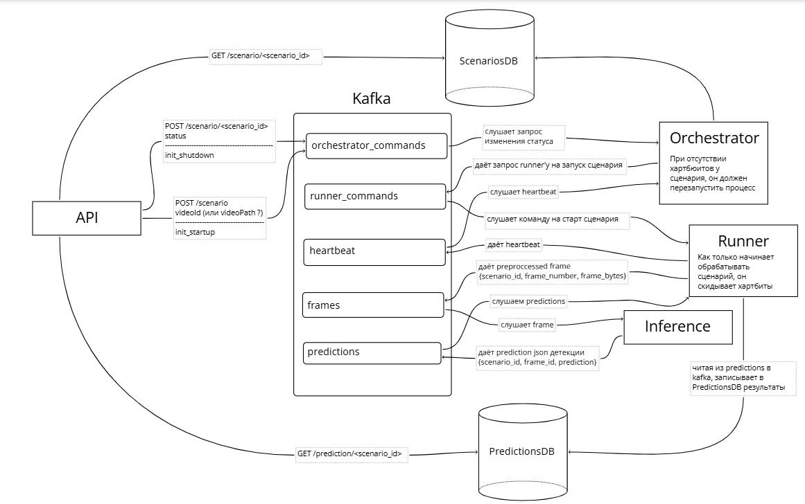

asyncpg, orch->rnr->PrDB with mocked frames and ml

# Overall structure


src includes all the services:
### [videoanalysis](src\videoanalysis) (API)
* Provides [FastAPI swagger interface](http://localhost:8000/docs) 
to interact with the project
* **reads from databases** 
* **writes orchestrator commands to kafka**

to run
```shell
poetry run uvicorn videoanalysis.main:app --reload --host 0.0.0.0 --port 8000
```

### [orchestrator](src\orchestrator)
(currently)
* **reads from orchestrator_commands topic**
* **writes to ScenariosDB directly**
* **writes to runner_commands topic**
```shell
poetry run python src/orchestrator/main.py
```


### [runner](src\runner)
(currently)
* Completely mocks inference and just
writes random stuff to PredictionsDB without even 
having any video to sample frames from
* **reads from runner_commands topic**
* **writes to PredictionsDB directly**
```shell
poetry run python src/runner/main.py
```

## Current state
### topics:
* runner_commands
* orchestrator_commands

### services:
* runner
* orchestrator
* api (3 working handlers)

### databases:
* ScenariosDB
* PredictionsDB

# Commands
### 0)
if u have internal network in docker, delete it. And pro-tip - use docker compose down -v to destroy volumes

### 1) Managing dependencies
```shell 
poetry install
```

---

### 2) Set up kafka, ScenarioDB, PredictionsDB
```shell 
docker compose up -d
```
You should also wait for approximately 20 seconds for kafka-init, 
predictions-init and scenarios-init to prepare the containers for 
proper use by the services

---

### 3) Set up API
```shell
poetry run uvicorn videoanalysis.main:app --reload --host 0.0.0.0 --port 8000
```

now you can go to http://localhost:8000/docs to use handlers

---

### 4) Set up Orchestrator
```shell
poetry run python src/orchestrator/main.py
```

---

### 5) Set up Runner
```shell
poetry run python src/orchestrator/main.py
```

---


## don't forget
* heartbeats
* env files to properly manage all the ports and stuff
* deployment on docker for services (at least runner and inference for scallability)
* outbox